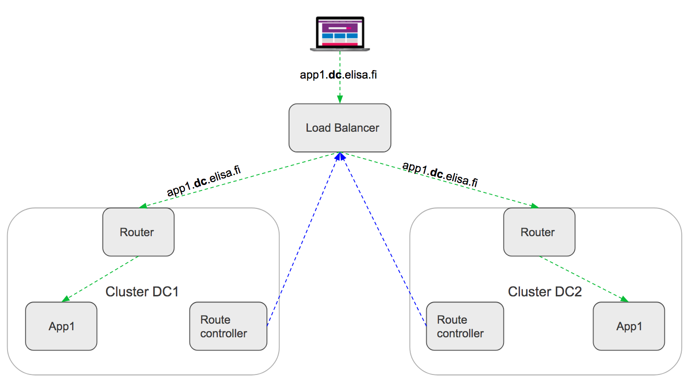

# Openshift-lb-controller

Openshift-lb-controller is component which listens changes in Openshift route object type in each cluster and updates load balancer accordingly.

It is supposed to deploy one controller pod per each cluster. Currently only F5 load balancer is supported but contributions are appreciated.

Lb-controller makes it possible to have "real" hybrid cloud. For instance you can have two different clusters in your own datacenter and one backup cluster in aws behind same load balancer. 

## Development

### Build from source
1. `make ensure`
2. `make build`
3. `./bin/openshift-lb-controller --run-outside-cluster`

`--run-outside-cluster` # Uses ~/.kube/config rather than in cluster configuration

### Run tests
1. `make test`

### Build docker image
1. `make build-image`

## Examples & Documentation

Check [docs](docs) and [examples](examples) folder

## Contributing

Create issues or/and PRs for us.